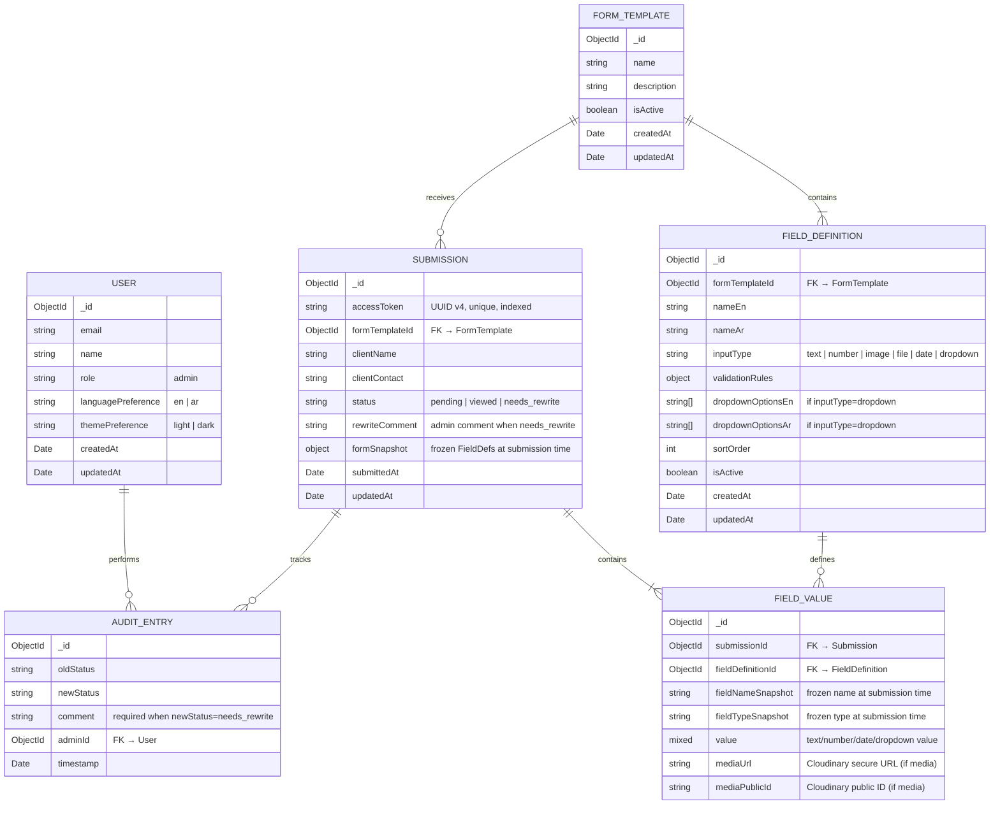

# Data Model: Dynamic Client Data Collection & Admin Review

**Feature**: 001-client-data-review
**Date**: 2026-04-13
**Database**: MongoDB (Mongoose ODM)

---

## Entity Relationship Diagram



---

## Entity Details

### 1. User

**Collection**: `users`
**Managed by**: Auth.js (NextAuth v5) with MongoDB adapter

| Field | Type | Required | Default | Notes |
|-------|------|----------|---------|-------|
| `_id` | ObjectId | auto | — | Primary key |
| `email` | String | yes | — | Unique, indexed |
| `name` | String | yes | — | Display name |
| `image` | String | no | null | Avatar URL (Auth.js standard) |
| `role` | String | yes | `"admin"` | Enum: `admin`. Only admins exist as User documents |
| `languagePreference` | String | no | `"en"` | Enum: `en`, `ar` |
| `themePreference` | String | no | `"light"` | Enum: `light`, `dark` |
| `emailVerified` | Date | no | null | Auth.js standard field |
| `createdAt` | Date | auto | `Date.now` | — |
| `updatedAt` | Date | auto | `Date.now` | — |

**Indexes**:
- `email`: unique

**Validation Rules**:
- `role` must be `"admin"`
- `languagePreference` must be `"en"` or `"ar"`
- `themePreference` must be `"light"` or `"dark"`

---

### 2. FormTemplate

**Collection**: `form_templates`

| Field | Type | Required | Default | Notes |
|-------|------|----------|---------|-------|
| `_id` | ObjectId | auto | — | Primary key |
| `name` | String | yes | — | Template display name |
| `description` | String | no | `""` | Admin-facing description |
| `isActive` | Boolean | yes | `true` | Only one template active at a time (v1) |
| `createdAt` | Date | auto | `Date.now` | — |
| `updatedAt` | Date | auto | `Date.now` | — |

**Indexes**:
- `isActive`: sparse (for quick active template lookup)

**Validation Rules**:
- `name` required, max 200 chars
- At most one document with `isActive: true` (enforced at application layer)

**Notes**: Per spec assumptions, "A single form template is active at any time; multi-form support is out of scope for v1."

---

### 3. FieldDefinition

**Collection**: `field_definitions`

| Field | Type | Required | Default | Notes |
|-------|------|----------|---------|-------|
| `_id` | ObjectId | auto | — | Primary key |
| `formTemplateId` | ObjectId | yes | — | FK → FormTemplate |
| `nameEn` | String | yes | — | English display label |
| `nameAr` | String | yes | — | Arabic display label |
| `inputType` | String | yes | — | Enum: `text`, `number`, `image`, `file`, `date`, `dropdown` |
| `validationRules` | Object | no | `{}` | `{ required: bool, minLength: num, maxLength: num, min: num, max: num, maxFileSize: num, allowedFileTypes: string[] }` |
| `dropdownOptionsEn` | [String] | conditional | `[]` | Required when `inputType` is `dropdown` |
| `dropdownOptionsAr` | [String] | conditional | `[]` | Required when `inputType` is `dropdown` |
| `sortOrder` | Number | yes | `0` | Display order (ascending) |
| `isActive` | Boolean | yes | `true` | Soft-delete to preserve historical data |
| `createdAt` | Date | auto | `Date.now` | — |
| `updatedAt` | Date | auto | `Date.now` | — |

**Indexes**:
- `{ formTemplateId: 1, sortOrder: 1 }`: compound, for ordered field retrieval
- `{ formTemplateId: 1, isActive: 1 }`: compound, for active field listing

**Validation Rules**:
- `nameEn` required, max 200 chars
- `nameAr` required, max 200 chars
- `inputType` must be one of the enum values
- `dropdownOptionsEn` required and non-empty when `inputType` is `dropdown`
- `dropdownOptionsAr` required and non-empty when `inputType` is `dropdown`; must match length of `dropdownOptionsEn`
- `sortOrder` must be a non-negative integer

**State Transitions**:
- Active → Inactive (soft-delete): field removed from new submissions, preserved in historical data
- Inactive → Active: (re-enable if needed)

---

### 4. Submission

**Collection**: `submissions`

| Field | Type | Required | Default | Notes |
|-------|------|----------|---------|-------|
| `_id` | ObjectId | auto | — | Primary key |
| `accessToken` | String | yes | — | UUID v4, used in shareable URL |
| `formTemplateId` | ObjectId | yes | — | FK → FormTemplate |
| `clientName` | String | yes | — | Client-entered name |
| `clientContact` | String | no | `""` | Client-entered contact info |
| `status` | String | yes | `"pending"` | Enum: `pending`, `viewed`, `needs_rewrite` |
| `rewriteComment` | String | no | `""` | Admin's comment when marking needs_rewrite |
| `formSnapshot` | Object | yes | — | Frozen copy of FieldDefinitions at submission time |
| `auditTrail` | [AuditEntry] | no | `[]` | Embedded audit log (see subdocument below) |
| `submittedAt` | Date | yes | `Date.now` | First submission timestamp |
| `lastResubmittedAt` | Date | no | null | Updated on each resubmission |
| `updatedAt` | Date | auto | `Date.now` | — |

**Subdocument: AuditEntry** (embedded in `auditTrail` array)

| Field | Type | Required | Notes |
|-------|------|----------|-------|
| `oldStatus` | String | yes | Previous status |
| `newStatus` | String | yes | New status |
| `comment` | String | conditional | Required when `newStatus` is `needs_rewrite` |
| `adminId` | ObjectId | yes | FK → User |
| `adminName` | String | yes | Denormalized admin name for display |
| `timestamp` | Date | yes | `Date.now` at creation |

**Indexes**:
- `accessToken`: unique (primary lookup by clients)
- `{ status: 1, submittedAt: -1 }`: compound, for admin dashboard filtering and sorting
- `{ formTemplateId: 1 }`: for submission listing by form

**Validation Rules**:
- `accessToken` required, unique, UUID v4 format
- `clientName` required, max 200 chars
- `status` must be one of the enum values
- `rewriteComment` required when `status` is `needs_rewrite`

**State Transitions**:
```
                  ┌──────────────────────────────────────┐
                  │                                      │
                  ▼                                      │
    ┌─────────────────┐     ┌───────────┐     ┌────────────────┐
    │    pending       │◄───►│  viewed   │◄───►│ needs_rewrite  │
    └─────────────────┘     └───────────┘     └────────────────┘
           ▲                                          │
           │                                          │
           └──────── client resubmits ────────────────┘
```
- All transitions are flexible (any status → any status) per admin action
- Client resubmission auto-resets status to `pending`

---

### 5. FieldValue

**Collection**: `field_values`

| Field | Type | Required | Default | Notes |
|-------|------|----------|---------|-------|
| `_id` | ObjectId | auto | — | Primary key |
| `submissionId` | ObjectId | yes | — | FK → Submission |
| `fieldDefinitionId` | ObjectId | yes | — | FK → FieldDefinition |
| `fieldNameSnapshot` | String | yes | — | Frozen field name at submission time |
| `fieldTypeSnapshot` | String | yes | — | Frozen input type at submission time |
| `value` | Mixed | no | null | For text, number, date, dropdown values |
| `mediaUrl` | String | no | null | Cloudinary secure URL (for image/file) |
| `mediaPublicId` | String | no | null | Cloudinary public ID (for cleanup on delete) |
| `createdAt` | Date | auto | `Date.now` | — |
| `updatedAt` | Date | auto | `Date.now` | — |

**Indexes**:
- `{ submissionId: 1 }`: for retrieving all values for a submission
- `{ submissionId: 1, fieldDefinitionId: 1 }`: compound unique, one value per field per submission

**Validation Rules**:
- Either `value` or `mediaUrl` must be present (not both null) if field is required
- `mediaPublicId` required when `mediaUrl` is present
- `fieldTypeSnapshot` must be a valid input type enum

**Notes**:
- When a FieldDefinition is soft-deleted, existing FieldValues remain intact (historical integrity per FR-012)
- When a Submission is hard-deleted, all associated FieldValues and Cloudinary assets are destroyed (per FR-019)

---

## Deletion Cascade Rules

| Action | Cascaded Effect |
|--------|-----------------|
| Delete FieldDefinition | Soft-delete only (`isActive: false`). Existing FieldValues preserved. |
| Delete Submission | Hard-delete: remove all FieldValues + destroy Cloudinary assets + remove audit entries. Confirmation dialog required. |
| Delete FormTemplate | Prevent if submissions exist. Soft-delete (`isActive: false`) otherwise. |

---

## Cache Keys (Upstash Redis)

| Key Pattern | TTL | Invalidated On |
|-------------|-----|----------------|
| `form:active` | 5 min | FormTemplate create/update/delete |
| `fields:{formTemplateId}` | 5 min | FieldDefinition create/update/delete/reorder |
| `submissions:list:{status}:{page}` | 1 min | Submission create/update/delete/status change |
| `submissions:counts` | 30 sec | Submission create/delete/status change |
| `submission:{accessToken}` | 2 min | Submission update/status change |
