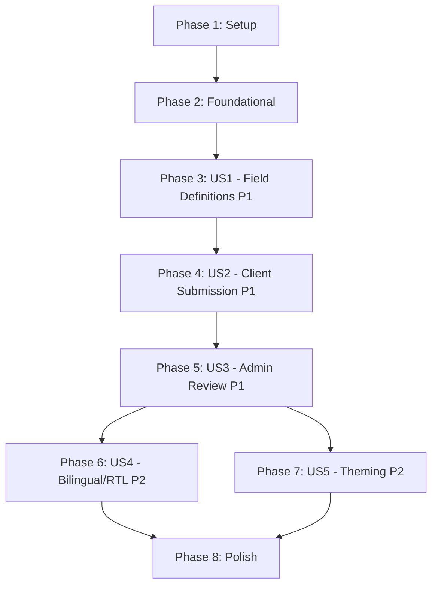

# Tasks: Dynamic Client Data Collection & Admin Review

**Input**: Design documents from `/specs/001-client-data-review/`
**Prerequisites**: plan.md ✅, spec.md ✅, research.md ✅, data-model.md ✅, contracts/ ✅, quickstart.md ✅

**Tests**: Not explicitly requested in the feature specification. Test tasks are omitted.

**Organization**: Tasks are grouped by user story to enable independent implementation and testing of each story.

## Format: `[ID] [P?] [Story] Description`

- **[P]**: Can run in parallel (different files, no dependencies)
- **[Story]**: Which user story this task belongs to (e.g., US1, US2, US3)
- Include exact file paths in descriptions

---

## Phase 1: Setup (Shared Infrastructure)

**Purpose**: Project initialization, dependency installation, and base configuration

- [ ] T001 Initialize Next.js project with TypeScript in `src/` using App Router at repository root
- [ ] T002 Install and configure ShadCN UI with `components.json` and base theme CSS variables in `src/app/globals.css`
- [ ] T003 [P] Install all project dependencies: mongoose, next-auth@beta, @auth/mongodb-adapter, next-cloudinary, cloudinary, @upstash/redis, @upstash/ratelimit, next-intl, next-themes, @dnd-kit/core, @dnd-kit/sortable, zod, uuid, lucide-react
- [ ] T004 [P] Create `.env.example` with all required environment variables (MONGODB_URI, AUTH_SECRET, Cloudinary keys, Upstash keys) at repository root
- [ ] T005 [P] Configure ESLint strict mode (no `any` types) and Prettier in `eslint.config.mjs` and `.prettierrc`
- [ ] T006 Create directory structure per implementation plan: `src/domain/`, `src/data/`, `src/presentation/`, `src/lib/`, `src/messages/`, `tests/`

---

## Phase 2: Foundational (Blocking Prerequisites)

**Purpose**: Core infrastructure that MUST be complete before ANY user story can be implemented

**⚠️ CRITICAL**: No user story work can begin until this phase is complete

- [ ] T007 Create MongoDB connection singleton with Mongoose in `src/lib/db.ts` (cached connection for serverless)
- [ ] T008 [P] Create Upstash Redis client singleton in `src/lib/redis.ts` with cache helper functions (get, set, del, invalidate pattern)
- [ ] T009 [P] Create Cloudinary service in `src/data/services/cloudinary-service.ts` (sign upload, destroy asset, generate transform URL)
- [ ] T010 [P] Create cache service in `src/data/services/cache-service.ts` implementing TTL-based caching with invalidation per data-model.md cache keys
- [ ] T011 Configure Auth.js v5 with MongoDB adapter and credentials provider in `src/lib/auth.ts` (session callback with role injection, database strategy)
- [ ] T012 Create Auth.js route handler in `src/app/api/auth/[...nextauth]/route.ts`
- [ ] T013 [P] Create User entity interface in `src/domain/entities/user.ts` (no framework imports)
- [ ] T014 [P] Create User Mongoose model in `src/data/models/user.model.ts` with role, languagePreference, themePreference fields per data-model.md
- [ ] T015 Create user repository interface in `src/domain/repositories/user-repository.ts` and implementation in `src/data/repositories/mongo-user-repository.ts`
- [ ] T016 [P] Create shared Zod validation schemas in `src/lib/validations.ts` (field definition schema, submission schema, status enum, preferences schema)
- [ ] T017 [P] Create shared utility functions in `src/lib/utils.ts` (cn helper, UUID generator, date formatters)
- [ ] T018 Configure next-intl with locale routing in `src/i18n.ts` and `src/middleware.ts` (en/ar locales, locale detection)
- [ ] T019 [P] Create English translation file `src/messages/en.json` with all UI string keys organized by page/component
- [ ] T020 [P] Create Arabic translation file `src/messages/ar.json` with all UI string keys matching en.json structure
- [ ] T021 Create root locale layout in `src/app/[locale]/layout.tsx` with ThemeProvider, NextIntlClientProvider, dir/lang attributes, suppressHydrationWarning
- [ ] T022 [P] Create ThemeProvider component in `src/presentation/providers/theme-provider.tsx` using next-themes with attribute="class"
- [ ] T023 [P] Create AuthProvider component in `src/presentation/providers/auth-provider.tsx` wrapping SessionProvider from next-auth
- [ ] T024 [P] Create LanguageSwitcher component in `src/presentation/components/shared/language-switcher/index.tsx` (toggle en/ar, update locale route, persist preference)
- [ ] T025 [P] Create ThemeToggle component in `src/presentation/components/shared/theme-toggle/index.tsx` (Sun/Moon icons, ShadCN DropdownMenu, useTheme hook)
- [ ] T026 Create Next.js middleware in `src/middleware.ts` integrating auth protection for `/admin/*` routes, i18n locale routing, and rate limiting via @upstash/ratelimit
- [ ] T027 Create admin layout in `src/app/[locale]/admin/layout.tsx` with sidebar navigation, LanguageSwitcher, ThemeToggle, and session guard
- [ ] T028 Create admin login page in `src/app/[locale]/admin/login/page.tsx` with email/password form using ShadCN Input, Button, Card components
- [ ] T029 [P] Create Cloudinary signing API route in `src/app/api/cloudinary/sign/route.ts` per contracts/cloudinary-auth.md
- [ ] T030 Create admin seed script in `scripts/seed-admin.ts` and add `seed:admin` npm script to `package.json`
- [ ] T031 Create landing page in `src/app/[locale]/page.tsx` that redirects authenticated admins to dashboard, shows generic welcome otherwise

**Checkpoint**: Foundation ready — auth works, DB connected, Redis connected, i18n works, theme toggle works, admin can log in. User story implementation can now begin.

---

## Phase 3: User Story 1 — Admin Defines Data Collection Fields (Priority: P1) 🎯 MVP

**Goal**: Admin can create a form template, add/edit/reorder/delete fields of various types, and the form becomes available for clients.

**Independent Test**: An admin creates a form with at least three fields of different types (text, image, dropdown), reorders them via drag-and-drop, saves, and verifies the field definitions are persisted.

### Domain Layer — US1

- [x] T032 [P] [US1] Create FormTemplate entity interface in `src/domain/entities/form-template.ts`
- [x] T033 [P] [US1] Create FieldDefinition entity interface in `src/domain/entities/field-definition.ts` with InputType enum and ValidationRules type
- [x] T034 [P] [US1] Create FormTemplate repository interface in `src/domain/repositories/form-template-repository.ts` (create, findById, findActive, update, delete)
- [x] T035 [P] [US1] Create FieldDefinition repository interface in `src/domain/repositories/field-definition-repository.ts` (create, findByFormId, update, softDelete, reorder)
- [x] T036 [US1] Create manage-forms use case in `src/domain/use-cases/admin/manage-forms.ts` (createForm, getForm, listForms, updateForm, deleteForm with submission check)
- [x] T037 [US1] Create manage-fields use case in `src/domain/use-cases/admin/manage-fields.ts` (createField, updateField, deleteField, reorderFields, listFields)

### Data Layer — US1

- [x] T038 [P] [US1] Create FormTemplate Mongoose model in `src/data/models/form-template.model.ts` with indexes per data-model.md
- [x] T039 [P] [US1] Create FieldDefinition Mongoose model in `src/data/models/field-definition.model.ts` with compound indexes, validation, and enum constraints per data-model.md
- [x] T040 [US1] Create MongoFormTemplateRepository in `src/data/repositories/mongo-form-template-repository.ts` implementing repository interface with cache integration
- [x] T041 [US1] Create MongoFieldDefinitionRepository in `src/data/repositories/mongo-field-definition-repository.ts` implementing repository interface with cache integration

### API Layer — US1

- [x] T042 [US1] Create admin forms API route in `src/app/api/admin/forms/route.ts` (POST, GET) per contracts/admin-forms.md
- [x] T043 [US1] Create admin forms detail API route in `src/app/api/admin/forms/[formId]/route.ts` (GET, PATCH, DELETE) per contracts/admin-forms.md
- [x] T044 [US1] Create admin fields API route in `src/app/api/admin/fields/route.ts` (POST, GET) per contracts/admin-fields.md
- [x] T045 [US1] Create admin fields detail API route in `src/app/api/admin/fields/[fieldId]/route.ts` (PATCH, DELETE) per contracts/admin-fields.md
- [x] T046 [US1] Create admin fields reorder API route in `src/app/api/admin/fields/reorder/route.ts` (PATCH) per contracts/admin-fields.md

### Presentation Layer — US1

- [x] T047 [US1] Create useFormManager ViewModel hook in `src/presentation/view-models/use-form-manager.ts` (CRUD operations, loading/error states, active form toggle)
- [x] T048 [US1] Create useFieldBuilder ViewModel hook in `src/presentation/view-models/use-field-builder.ts` (field CRUD, drag-and-drop reordering state, field type selection)
- [x] T049 [US1] Create FormManager component in `src/presentation/components/admin/form-manager/index.tsx` (form list with create dialog, active indicator, ShadCN Card + Dialog)
- [x] T050 [US1] Create FieldBuilder component in `src/presentation/components/admin/field-builder/index.tsx` (@dnd-kit sortable list of field cards with inline add/edit/delete)
- [x] T051 [US1] Create FieldCard component in `src/presentation/components/admin/field-builder/field-card.tsx` (draggable card showing field name, type, validation, edit/delete actions)
- [x] T052 [US1] Create FieldFormDialog component in `src/presentation/components/admin/field-builder/field-form-dialog.tsx` (ShadCN Dialog with form for field creation/editing: bilingual names, type selector, validation rules, dropdown options)
- [x] T053 [US1] Create admin forms page in `src/app/[locale]/admin/forms/page.tsx` integrating FormManager component
- [x] T054 [US1] Create admin field builder page in `src/app/[locale]/admin/forms/[id]/fields/page.tsx` integrating FieldBuilder component

**Checkpoint**: Admin can log in, create a form template, add fields of all types (text, number, image, file, date, dropdown), reorder via drag-and-drop, edit, and soft-delete fields. This is the MVP.

---

## Phase 4: User Story 2 — Client Submits Data (Priority: P1)

**Goal**: Client opens a unique shareable link, sees dynamically rendered form based on admin-defined fields, fills in data (including media uploads via Cloudinary), submits, and sees confirmation. Revisiting the link shows submission status.

**Independent Test**: A client opens a unique form link, fills out a form with mixed field types (text, image upload, number), submits, sees a success confirmation, and the submission appears in the database.

### Domain Layer — US2

- [x] T055 [P] [US2] Create Submission entity interface in `src/domain/entities/submission.ts` with SubmissionStatus enum and AuditEntry type
- [x] T056 [P] [US2] Create FieldValue entity interface in `src/domain/entities/field-value.ts`
- [x] T057 [P] [US2] Create Submission repository interface in `src/domain/repositories/submission-repository.ts` (create, findByToken, update, delete)
- [x] T058 [P] [US2] Create FieldValue repository interface in `src/domain/repositories/field-value-repository.ts` (createMany, findBySubmissionId, updateMany, deleteBySubmissionId)
- [x] T059 [US2] Create submit-form use case in `src/domain/use-cases/client/submit-form.ts` (validateFields against active form, create submission with formSnapshot, create field values, handle media references)
- [x] T060 [US2] Create view-submission use case in `src/domain/use-cases/client/view-submission.ts` (lookup by accessToken, return existing submission or fresh form)

### Data Layer — US2

- [x] T061 [P] [US2] Create Submission Mongoose model in `src/data/models/submission.model.ts` with embedded AuditEntry subdocument schema, indexes per data-model.md
- [x] T062 [P] [US2] Create FieldValue Mongoose model in `src/data/models/field-value.model.ts` with compound unique index per data-model.md
- [x] T063 [US2] Create MongoSubmissionRepository in `src/data/repositories/mongo-submission-repository.ts` implementing repository interface with cache integration
- [x] T064 [US2] Create MongoFieldValueRepository in `src/data/repositories/mongo-field-value-repository.ts` implementing repository interface

### API Layer — US2

- [x] T065 [US2] Create client submission API route in `src/app/api/submissions/[token]/route.ts` (GET, POST, PUT) per contracts/client-submissions.md
- [x] T066 [US2] Create generate-link API route in `src/app/api/submissions/generate-link/route.ts` (POST, admin-only) per contracts/client-submissions.md

### Presentation Layer — US2

- [x] T067 [US2] Create useSubmissionForm ViewModel hook in `src/presentation/view-models/use-submission-form.ts` (form state, field validation, submission, Cloudinary upload handling, resubmission)
- [x] T068 [US2] Create DynamicForm component in `src/presentation/components/client/dynamic-form/index.tsx` (renders fields dynamically based on FieldDefinition type: text input, number input, date picker, dropdown select)
- [x] T069 [US2] Create MediaUploadField component in `src/presentation/components/client/dynamic-form/media-upload-field.tsx` (CldUploadWidget with signatureEndpoint, preview thumbnail, file size validation, progress indicator)
- [x] T070 [US2] Create SubmissionStatus component in `src/presentation/components/client/submission-status/index.tsx` (shows current status, rewrite comment if needs_rewrite, resubmit button)
- [x] T071 [US2] Create MediaViewer component in `src/presentation/components/shared/media-viewer/index.tsx` (inline image display with Cloudinary transformations, file download links)
- [x] T072 [US2] Create client submission page in `src/app/[locale]/submit/[token]/page.tsx` (server component that fetches form/submission data, renders DynamicForm or SubmissionStatus conditionally)

**Checkpoint**: End-to-end client flow works — admin generates link, client opens it, fills form with mixed types + image uploads, submits, sees confirmation. Revisiting link shows status. Resubmission works when status is needs_rewrite.

---

## Phase 5: User Story 3 — Admin Reviews Submissions (Priority: P1)

**Goal**: Admin opens the review dashboard, sees all submissions listed with status filtering, opens a submission to view all data inline (including images), changes status (Viewed/Needs Rewrite/Pending) with required comments, and the full audit trail is maintained.

**Independent Test**: An admin opens a submission, views all fields including inline images, changes status to "Needs Rewrite" with a comment, and verifies the audit trail records the change. Client sees updated status.

### Domain Layer — US3

- [x] T073 [P] [US3] Create AuditEntry entity interface in `src/domain/entities/audit-entry.ts`
- [x] T074 [US3] Create review-submissions use case in `src/domain/use-cases/admin/review-submissions.ts` (listSubmissions with pagination/filter, getSubmissionDetail, updateStatus with audit entry, deleteSubmission with Cloudinary cleanup, getShareableLink)

### API Layer — US3

- [x] T075 [US3] Create admin submissions list API route in `src/app/api/admin/submissions/route.ts` (GET with pagination, status filter, sorting) per contracts/admin-submissions.md
- [x] T076 [US3] Create admin submission detail API route in `src/app/api/admin/submissions/[submissionId]/route.ts` (GET, DELETE) per contracts/admin-submissions.md
- [x] T077 [US3] Create admin submission status API route in `src/app/api/admin/submissions/[submissionId]/status/route.ts` (PATCH) per contracts/admin-submissions.md
- [x] T078 [US3] Create admin submission link API route in `src/app/api/admin/submissions/[submissionId]/link/route.ts` (GET) per contracts/admin-submissions.md

### Presentation Layer — US3

- [x] T079 [US3] Create useDashboard ViewModel hook in `src/presentation/view-models/use-dashboard.ts` (submission list with pagination, status filter, status counts, loading states)
- [x] T080 [US3] Create useSubmissionReview ViewModel hook in `src/presentation/view-models/use-submission-review.ts` (submission detail, status change, comment, delete with confirmation, copy link)
- [x] T081 [US3] Create SubmissionTable component in `src/presentation/components/admin/submission-table/index.tsx` (ShadCN Table with columns: client name, date, status badge, actions; status filter tabs; pagination)
- [x] T082 [US3] Create StatusBadge component in `src/presentation/components/admin/submission-table/status-badge.tsx` (color-coded badges for pending/viewed/needs_rewrite)
- [x] T083 [US3] Create SubmissionDetail component in `src/presentation/components/admin/submission-detail/index.tsx` (full field value display with inline images via MediaViewer, status actions, rewrite comment input, audit trail timeline)
- [x] T084 [US3] Create AuditTimeline component in `src/presentation/components/admin/submission-detail/audit-timeline.tsx` (chronological list of status changes with admin name, timestamp, comment)
- [x] T085 [US3] Create DeleteConfirmDialog component in `src/presentation/components/admin/submission-detail/delete-confirm-dialog.tsx` (ShadCN AlertDialog warning about permanent deletion of data + Cloudinary assets)
- [x] T086 [US3] Create admin dashboard page in `src/app/[locale]/admin/dashboard/page.tsx` integrating SubmissionTable with status count summary cards
- [x] T087 [US3] Create admin submission detail page or modal integrating SubmissionDetail at `src/app/[locale]/admin/dashboard/[submissionId]/page.tsx`

**Checkpoint**: Full admin review workflow — dashboard lists submissions, admin can filter by status, view detail with inline images, change status with comments, see audit trail, delete submissions, and copy shareable links for client resubmission.

---

## Phase 6: User Story 4 — Bilingual Interface with RTL Support (Priority: P2)

**Goal**: Both admin and client interfaces can switch between Arabic and English at any time, with full RTL layout switching when Arabic is selected. Language preference persists across sessions.

**Independent Test**: A user switches from English to Arabic, verifies all UI text is translated and layout direction changes to RTL. Refreshing the page retains the preference.

- [ ] T088 [US4] Audit and complete all translation keys in `src/messages/en.json` ensuring 100% coverage of UI strings across all pages (admin dashboard, form builder, submission form, login, status messages, error messages, validation messages)
- [ ] T089 [US4] Audit and complete all translation keys in `src/messages/ar.json` matching en.json structure with accurate Arabic translations for all strings
- [ ] T090 [US4] Update root locale layout `src/app/[locale]/layout.tsx` to dynamically set `dir` attribute based on locale (rtl for ar, ltr for en) using Intl.Locale.textInfo
- [ ] T091 [US4] Audit all CSS in ShadCN components and custom styles to use CSS logical properties (margin-inline-start, padding-inline-end, inset-inline-start) instead of physical properties (margin-left, padding-right, left)
- [ ] T092 [US4] Create admin preferences API route in `src/app/api/admin/preferences/route.ts` (GET, PATCH) per contracts/cloudinary-auth.md for persisting language preference server-side
- [ ] T093 [US4] Create manage-preferences use case in `src/domain/use-cases/admin/manage-preferences.ts` (getPreferences, updatePreferences for language and theme)
- [ ] T094 [US4] Update LanguageSwitcher component to persist preference via preferences API for authenticated admins and via localStorage for unauthenticated clients in `src/presentation/components/shared/language-switcher/index.tsx`
- [ ] T095 [US4] Verify bilingual field labels display correctly — FieldBuilder shows both nameEn/nameAr; DynamicForm shows label matching active locale in `src/presentation/components/admin/field-builder/` and `src/presentation/components/client/dynamic-form/`

**Checkpoint**: Full bilingual support — all text translated, RTL layout correct for Arabic, language preference persists for both admin and client users.

---

## Phase 7: User Story 5 — Dark and Light Theme Toggle (Priority: P2)

**Goal**: Users can switch between dark and light themes. The theme applies across all pages and persists across sessions.

**Independent Test**: A user toggles to dark theme, navigates through all pages, confirms all text is legible and components render correctly. Preference persists after refresh.

- [ ] T096 [US5] Configure ShadCN CSS variables for dark and light themes in `src/app/globals.css` (background, foreground, card, popover, primary, secondary, muted, accent, destructive, border, input, ring colors for both themes)
- [ ] T097 [US5] Update ThemeToggle component to persist theme preference via preferences API for authenticated admins in `src/presentation/components/shared/theme-toggle/index.tsx`
- [ ] T098 [US5] Audit all custom components for dark mode compatibility — ensure no hard-coded colors, all use CSS variables or ShadCN primitives across `src/presentation/components/`
- [ ] T099 [US5] Verify theme toggle works on all pages: login, dashboard, form builder, field builder, submission form, submission status — no visual artifacts or illegible text

**Checkpoint**: Dark/light theme works across all pages, preference persists, no visual issues in either theme.

---

## Phase 8: Polish & Cross-Cutting Concerns

**Purpose**: Improvements that affect multiple user stories, edge case handling, and production readiness

- [ ] T100 [P] Implement concurrent form edit detection — warn admin if form definition was modified since page load (last-save-wins with warning) in `src/app/api/admin/fields/route.ts`
- [ ] T101 [P] Implement file upload error handling — user-friendly error when Cloudinary is temporarily unavailable, retry without losing filled fields in `src/presentation/components/client/dynamic-form/media-upload-field.tsx`
- [ ] T102 [P] Implement form snapshot validation — submission validates against field definitions active at client form load time in `src/domain/use-cases/client/submit-form.ts`
- [ ] T103 [P] Add loading skeletons and optimistic UI updates for admin dashboard and form builder using ShadCN Skeleton in `src/presentation/components/admin/`
- [ ] T104 [P] Implement responsive/mobile layout for all pages — ensure touch-friendly form builder, submission form usable on mobile in `src/app/globals.css` and relevant components
- [ ] T105 [P] Add SEO metadata (title, description) to all pages using Next.js Metadata API in each `page.tsx` and `layout.tsx`
- [ ] T106 [P] Create error boundary and not-found pages in `src/app/[locale]/error.tsx` and `src/app/[locale]/not-found.tsx`
- [ ] T107 Add global error handling and input sanitization middleware for all API routes in `src/lib/api-helpers.ts` (XSS protection, consistent error response format)
- [ ] T108 Run quickstart.md validation — verify all setup steps, environment variables, seed script, and dev server startup work end-to-end
- [ ] T109 Final review of all i18n strings — ensure zero hard-coded text in any component across `src/presentation/` and `src/app/`

---

## Dependencies & Execution Order

### Phase Dependencies

- **Setup (Phase 1)**: No dependencies — can start immediately
- **Foundational (Phase 2)**: Depends on Setup completion — BLOCKS all user stories
- **US1 (Phase 3)**: Depends on Foundational (Phase 2) — No dependencies on other stories
- **US2 (Phase 4)**: Depends on Foundational (Phase 2) + US1 models (FormTemplate, FieldDefinition) for rendering the dynamic form
- **US3 (Phase 5)**: Depends on Foundational (Phase 2) + US2 models (Submission, FieldValue) for reviewing submissions
- **US4 (Phase 6)**: Depends on all P1 stories (Phases 3-5) — audits and completes translations
- **US5 (Phase 7)**: Depends on all P1 stories (Phases 3-5) — audits theme compatibility
- **Polish (Phase 8)**: Depends on all user stories being complete

### User Story Dependencies



- **US1 → US2**: US2 depends on FormTemplate and FieldDefinition entities/models from US1 to render the dynamic form
- **US2 → US3**: US3 depends on Submission and FieldValue entities/models from US2 to review submissions
- **US4, US5**: These cross-cutting P2 stories audit existing UI and can run in parallel with each other after P1 stories are complete

### Within Each User Story

- Domain entities and repository interfaces first (parallelizable)
- Use cases depend on repository interfaces
- Mongoose models (parallelizable)
- Repository implementations depend on models + interfaces
- API routes depend on use cases + repositories
- ViewModel hooks depend on API routes
- UI components depend on ViewModel hooks
- Page files integrate components

### Parallel Opportunities

- T003, T004, T005 can run in parallel (Setup phase)
- T008, T009, T010 can run in parallel (service infrastructure)
- T013, T014, T016, T017 can run in parallel (shared models/utilities)
- T019, T020 can run in parallel (translation files)
- T022, T023, T024, T025 can run in parallel (provider/shared components)
- T032, T033, T034, T035 can run in parallel (US1 domain layer)
- T038, T039 can run in parallel (US1 Mongoose models)
- T055, T056, T057, T058 can run in parallel (US2 domain layer)
- T061, T062 can run in parallel (US2 Mongoose models)
- US4 and US5 can run in parallel after P1 stories complete
- All Phase 8 tasks marked [P] can run in parallel

---

## Parallel Example: User Story 1

```bash
# Launch all domain entities/interfaces for US1 together:
Task: "T032 [P] [US1] Create FormTemplate entity interface in src/domain/entities/form-template.ts"
Task: "T033 [P] [US1] Create FieldDefinition entity interface in src/domain/entities/field-definition.ts"
Task: "T034 [P] [US1] Create FormTemplate repository interface in src/domain/repositories/form-template-repository.ts"
Task: "T035 [P] [US1] Create FieldDefinition repository interface in src/domain/repositories/field-definition-repository.ts"

# Then launch both Mongoose models together:
Task: "T038 [P] [US1] Create FormTemplate Mongoose model in src/data/models/form-template.model.ts"
Task: "T039 [P] [US1] Create FieldDefinition Mongoose model in src/data/models/field-definition.model.ts"
```

## Parallel Example: User Story 2

```bash
# Launch all domain entities/interfaces for US2 together:
Task: "T055 [P] [US2] Create Submission entity interface in src/domain/entities/submission.ts"
Task: "T056 [P] [US2] Create FieldValue entity interface in src/domain/entities/field-value.ts"
Task: "T057 [P] [US2] Create Submission repository interface in src/domain/repositories/submission-repository.ts"
Task: "T058 [P] [US2] Create FieldValue repository interface in src/domain/repositories/field-value-repository.ts"

# Then launch both Mongoose models together:
Task: "T061 [P] [US2] Create Submission Mongoose model in src/data/models/submission.model.ts"
Task: "T062 [P] [US2] Create FieldValue Mongoose model in src/data/models/field-value.model.ts"
```

---

## Implementation Strategy

### MVP First (User Story 1 Only)

1. Complete Phase 1: Setup
2. Complete Phase 2: Foundational (CRITICAL — blocks all stories)
3. Complete Phase 3: User Story 1 — Admin can define forms and fields
4. **STOP and VALIDATE**: Test that admin can create a form, add 3+ fields, reorder, edit, delete
5. Deploy/demo if ready — this proves the form builder works

### Incremental Delivery

1. Complete Setup + Foundational → Foundation ready
2. Add User Story 1 → Test independently → **Deploy/Demo (MVP!)**
3. Add User Story 2 → Test client submission flow → Deploy/Demo
4. Add User Story 3 → Test admin review workflow → Deploy/Demo (Full P1 delivery!)
5. Add User Story 4 → Full bilingual/RTL → Deploy/Demo
6. Add User Story 5 → Dark/light theme → Deploy/Demo
7. Polish phase → Production-ready

### Sequential Strategy (Recommended for Solo Developer)

Because of entity dependencies (US1 → US2 → US3), the recommended execution order is strictly sequential through P1 stories:

1. **Phase 1 + 2**: Setup + Foundational (~31 tasks)
2. **Phase 3**: US1 Field Definitions (~23 tasks)
3. **Phase 4**: US2 Client Submission (~18 tasks)
4. **Phase 5**: US3 Admin Review (~15 tasks)
5. **Phases 6 + 7**: US4 + US5 in parallel (~12 tasks)
6. **Phase 8**: Polish (~10 tasks)

---

## Notes

- [P] tasks = different files, no dependencies on incomplete work
- [Story] label maps task to specific user story for traceability
- Each user story should be independently testable at its checkpoint
- Commit after each task or logical group
- Stop at any checkpoint to validate story independently
- All API routes must validate input with Zod schemas from `src/lib/validations.ts`
- All data access must go through repository pattern (domain → data layer)
- All UI strings must use next-intl translation keys — no hard-coded text
- All CSS must use logical properties for RTL compatibility
