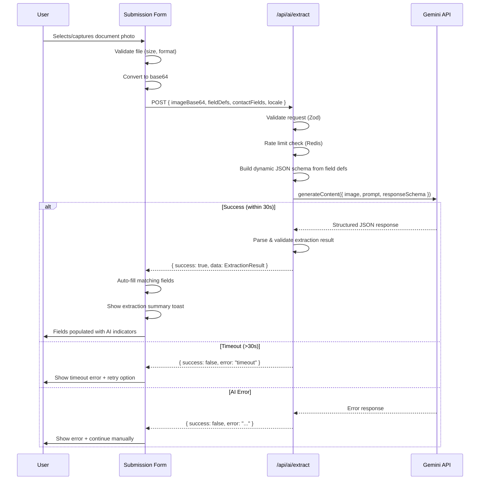

# API Contract: AI Document Extraction

**Endpoint**: `POST /api/ai/extract`
**Feature**: 014-ai-photo-autofill
**Date**: 2026-05-23

## Overview

Server-side API route that receives a document image (base64-encoded) and form field definitions, sends them to Google Gemini for structured data extraction, and returns field-ID-keyed values for auto-fill.

## Authentication

- **No auth required** for the extraction endpoint itself (client submission forms are public).
- **Rate limited** via Upstash Redis (same pattern as other submission endpoints).
- Suggested limit: 5 requests per minute per IP.

## Request

### Headers

| Header | Value | Required |
|--------|-------|----------|
| `Content-Type` | `application/json` | Yes |

### Body

```json
{
  "imageBase64": "string (base64-encoded image data, max ~14MB)",
  "imageMimeType": "string (image/jpeg | image/png | image/webp | image/heic)",
  "fieldDefinitions": [
    {
      "id": "string (field definition MongoDB ID)",
      "nameEn": "string",
      "nameAr": "string",
      "inputType": "string (text | number | date | dropdown)",
      "dropdownOptionsEn": ["string"],
      "dropdownOptionsAr": ["string"]
    }
  ],
  "contactFields": [
    {
      "key": "string (name | email | phone | address)",
      "labelEn": "string",
      "labelAr": "string"
    }
  ],
  "locale": "string (en | ar)"
}
```

### Validation

| Field | Rule |
|-------|------|
| `imageBase64` | Required, non-empty, max length ~14,000,000 chars |
| `imageMimeType` | Required, must be one of: `image/jpeg`, `image/png`, `image/webp`, `image/heic` |
| `fieldDefinitions` | Required, array, min length 0 |
| `contactFields` | Required, array, min length 0 |
| `locale` | Required, must be `en` or `ar` |

## Response

### Success (200)

```json
{
  "success": true,
  "data": {
    "status": "success | partial | failure",
    "contactData": {
      "name": "string | null",
      "email": "string | null",
      "phone": "string | null",
      "address": "string | null"
    },
    "fieldValues": {
      "<fieldId>": {
        "value": "string | number | null",
        "confidence": 0.95
      }
    },
    "errorMessage": "string | null"
  }
}
```

### Status Values

| Status | Meaning |
|--------|---------|
| `success` | All or most fields were confidently extracted |
| `partial` | Some fields extracted, others could not be determined |
| `failure` | No meaningful data could be extracted from the image |

### Error Responses

**400 Bad Request** — Invalid input

```json
{
  "success": false,
  "error": "Invalid image format. Accepted: JPEG, PNG, WEBP, HEIC"
}
```

**413 Payload Too Large** — Image exceeds size limit

```json
{
  "success": false,
  "error": "Image exceeds maximum size of 10MB"
}
```

**429 Too Many Requests** — Rate limited

```json
{
  "success": false,
  "error": "Too many extraction requests. Please wait and try again."
}
```

**504 Gateway Timeout** — AI service timeout (30 seconds)

```json
{
  "success": false,
  "error": "Document analysis timed out. Please try again with a clearer image."
}
```

**500 Internal Server Error** — Unexpected failure

```json
{
  "success": false,
  "error": "An unexpected error occurred during document analysis."
}
```

## Sequence Diagram



## Rate Limiting

| Parameter | Value |
|-----------|-------|
| Window | 1 minute |
| Max requests | 5 per IP |
| Backing store | Upstash Redis |
| Response on limit | 429 with retry-after header |
