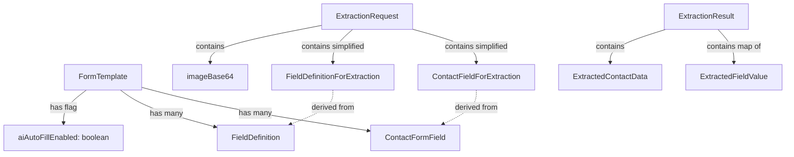

# Data Model: AI Photo Auto-Fill

**Feature**: 014-ai-photo-autofill
**Date**: 2026-05-23

## Entity Changes

### Modified Entity: FormTemplate

**File**: `src/domain/entities/form-template.ts`

| Field | Type | Required | Default | Notes |
|-------|------|----------|---------|-------|
| `aiAutoFillEnabled` | `boolean` | No | `false` | Admin toggle to enable/disable AI auto-fill on this form |

**Mongoose Model Change** (`src/data/models/form-template.model.ts`):
```
aiAutoFillEnabled: { type: Boolean, default: false }
```

No migration needed — new field with default value. Existing documents automatically read as `false`.

---

### New Entity: ExtractionResult

**File**: `src/domain/entities/ai-extraction.ts`

This is a **transient** entity (not persisted to database). It represents the structured output from a single AI extraction request.

| Field | Type | Required | Notes |
|-------|------|----------|-------|
| `status` | `"success" \| "partial" \| "failure"` | Yes | Overall extraction outcome |
| `contactData` | `ExtractedContactData` | Yes | Extracted contact record values |
| `fieldValues` | `Record<string, ExtractedFieldValue>` | Yes | Keyed by field definition ID |
| `errorMessage` | `string \| null` | No | Human-readable error if status is failure |

### New Value Object: ExtractedContactData

| Field | Type | Required | Notes |
|-------|------|----------|-------|
| `name` | `string \| null` | No | Extracted full name |
| `email` | `string \| null` | No | Extracted email address |
| `phone` | `string \| null` | No | Extracted phone number |
| `address` | `string \| null` | No | Extracted address |

### New Value Object: ExtractedFieldValue

| Field | Type | Required | Notes |
|-------|------|----------|-------|
| `value` | `string \| number \| null` | Yes | The extracted value |
| `confidence` | `number` | Yes | Confidence score 0.0–1.0 |

---

### New Type: ExtractionRequest

**File**: `src/lib/validations/ai-extraction.ts` (Zod schema)

| Field | Type | Required | Notes |
|-------|------|----------|-------|
| `imageBase64` | `string` | Yes | Base64-encoded document image (max ~10MB encoded) |
| `imageMimeType` | `string` | Yes | MIME type: image/jpeg, image/png, image/webp, image/heic |
| `fieldDefinitions` | `FieldDefinitionForExtraction[]` | Yes | Simplified field defs for AI context |
| `contactFields` | `ContactFieldForExtraction[]` | Yes | Contact form field config |
| `locale` | `"en" \| "ar"` | Yes | User's active locale for AI prompt language |

### New Type: FieldDefinitionForExtraction

Lightweight version of FieldDefinition sent to the AI:

| Field | Type | Required | Notes |
|-------|------|----------|-------|
| `id` | `string` | Yes | Field definition ID (used as JSON key in response) |
| `nameEn` | `string` | Yes | English label |
| `nameAr` | `string` | Yes | Arabic label |
| `inputType` | `InputType` | Yes | text, number, date, dropdown |
| `dropdownOptionsEn` | `string[]` | No | For dropdown fields only |
| `dropdownOptionsAr` | `string[]` | No | For dropdown fields only |

### New Type: ContactFieldForExtraction

| Field | Type | Required | Notes |
|-------|------|----------|-------|
| `key` | `ContactFormFieldKey` | Yes | name, email, phone, address |
| `labelEn` | `string` | Yes | English label |
| `labelAr` | `string` | Yes | Arabic label |

---

## Relationships



## Validation Rules

| Entity | Rule | Enforcement |
|--------|------|-------------|
| ExtractionRequest.imageBase64 | Max ~14MB (10MB file → ~13.3MB base64) | Zod schema + API route |
| ExtractionRequest.imageMimeType | Must be one of: image/jpeg, image/png, image/webp, image/heic | Zod enum |
| ExtractedFieldValue.confidence | Must be 0.0–1.0 | Zod number().min(0).max(1) |
| ExtractionResult.status | Must be one of: success, partial, failure | Zod enum |
| FormTemplate.aiAutoFillEnabled | Boolean, defaults false | Mongoose schema default |

## State Transitions

The ExtractionResult entity is transient and follows this lifecycle:

```
[User uploads photo]
    → ExtractionRequest created (client-side)
    → Sent to /api/ai/extract
    → Gemini API called (server-side)
    → ExtractionResult returned
        → status: "success" → all matching fields auto-filled
        → status: "partial" → some fields filled, summary shown
        → status: "failure" → error message shown, manual entry continues
    → ExtractionResult discarded (not persisted)
```
